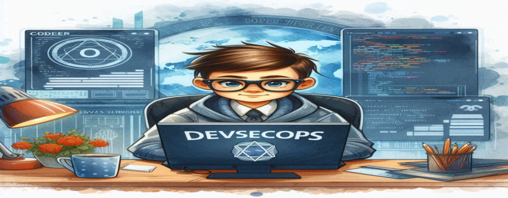

<h1 align="center">
  
</h1>

<h3 align="center">Enthusiastic DevSecOps newcomer from India, eager to learn, grow, and secure the future! Passionate about automation, CI/CD, and cloud technologies, I'm ready to contribute, tackle new challenges, and fuse speed with security.</h3>

  
  
  

         

  

    <h3 align="center" style="color: #4A90E2;">🌐 <strong>Aspiring DevSecOps Engineer</strong> | Securing the Future of DevOps</h3>
    

      
      
      
      
      
    

    

      <ul style="list-style-type: none; padding: 0; text-align: left;">
        <li>🔒 <strong>Building a Secure Tomorrow:</strong> Focused on integrating security at every stage of the DevOps lifecycle.</li>
        <li>🛠️ <strong>Passionate Learner:</strong> Exploring cutting-edge tools like SonarQube, Trivy, and Kubernetes to automate and enhance security in CI/CD pipelines.</li>
        <li>🌱 <strong>Constant Growth:</strong> Embracing the DevSecOps mindset to blend development, operations, and security seamlessly.</li>
        <li>🚀 <strong>Innovation-Driven:</strong> Dedicated to creating robust, scalable, and secure cloud-native applications.</li>
        <li>🤝 <strong>Collaborative Spirit:</strong> Excited about connecting with like-minded developers and security enthusiasts to share knowledge and ideas.</li>
        <li>👨‍💻 All of my projects are available at [GitHub Profile](https://github.com/Sachin-panigrahi)</li>
        <li>💬 Ask me about <strong>DevOps</strong></li>
        <li>📫 Reach me at: <strong>Sachinpanigrahi25@gmail.com</strong></li>
        <li>⚡ Fun fact: <strong>"DevOps by day, securing it with DevSecOps by night – bridging the gap between speed and security!"</strong></li>
      </ul>
    

  

  

  
  

<!-- 
 -->
<h3 align="left">Connect with me:</h3>

  

<h3 align="left">Languages and Tools:</h3>

   
  
   
   
  
  
  
  
  
  
  
  
  

&nbsp;

### 🔝 Top Contributed Repo

### Ingesting...

